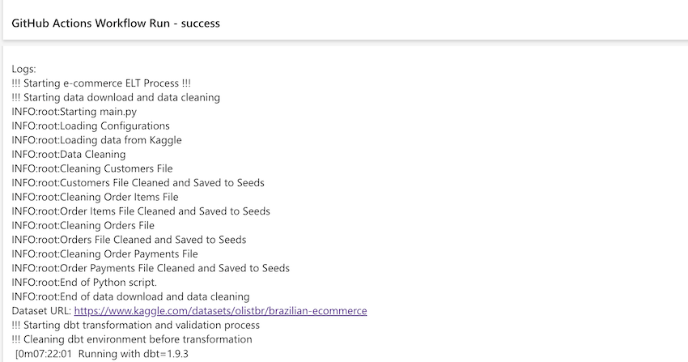

# **Olist ELT Implementation Technical Report**

**Prepared by:**
- Bai HuiJing
- Lim Kah Hui Esther
- Mathavan Arugalaimuthu
- Tang Lai Lin
- Thomas Tay

## **1. Introduction**

- This document provides a technical overview of the Extract, Load, and Transform (ELT) process implemented for processing the **Kaggle Olist Dataset**. 
- The pipeline is designed to automate data ingestion, cleaning, transformation, and storage using **BigQuery** as the primary data warehouse. 
- **dbt** is used as the tool for data ingestion and transformation. 
- Execution is automated through **GitHub Workflow**, with **GitHub Runner** handling the execution process.


## **2. Executive Summary**

### **2.1 Overview of the ELT Process**


- The ELT pipeline extracts data from Kaggle, cleans it, and loads it into **BigQuery** using **dbt seed** for transformation and analysis.
- **GitHub Actions** automates the workflow, ensuring scheduled execution.
- **dbt** is used for data transformation, offering a SQL-based framework for analytics engineers.
- **dbt test** is used to validate the data integrity of the transformed dataset.

### **2.2 Key Findings and Insights**
- **BigQuery** is preferred over **DuckDB** due to scalability and better tooling support.
- **BigQuery** provides user-friendly tools like **Looker Studio** for non-technical users.
- **dbt seed** is simpler and more effective than **Meltano** for managing raw data.
- Using **BigQuery** allows integration with multiple source and target databases.

### **2.3 Challenges and Recommendations**
- **DuckDB file locking** is difficult to manage; **BigQuery** is a better alternative.
- **GitHub Actions' scheduling** is not guaranteed to be on time; an external scheduler such as Google Scheduler should be considered.
- Managing secret keys securely remains a challenge; using **GitHub Secrets** is recommended.
- More dbt macros and unit test should be added to improve data integrity.

## **3. Infrastructure Overview**

Our ELT pipeline is designed to efficiently process and store data using **Google BigQuery** for scalable storage and **GitHub Runner** for execution.

### **3.1 Storage: Google BigQuery**
- Serves as the primary data warehouse.
- Optimized for analytical queries.
- Supports multiple source and target databases.


### **3.2 Execution: GitHub Runner**
- Automates pipeline execution.
- Ensures reproducibility across environments.
- Handles error logging and notifications.


## **4. Data Warehouse Design**

- **Star Schema**: We use star schema to define the dimension table and the facts table
- **Staging Models**: Clean and prepare raw data for downstream transformations.
- **Dimensional Models**: Create analytics-ready tables such as `dim_customers` and `dim_products`.
- **Fact Models**: Aggregate transactional data for reporting and analysis.
- **Testing**: Ensure data quality using dbt's built-in testing framework and additional packages.


## **5. ELT Process**

The following diagram show the technical flow of the ELT process:


The following shell script (`run.sh`) initiates the ELT process:

```bash
echo '!!! Starting e-commerce ELT Process !!!'

echo '!!! Starting data download and data cleaning'
python main.py

echo '!!! Starting dbt transformation and validation process'
cd dbt_ecomm

echo '!!! Cleaning dbt environment before transformation'
dbt clean

echo '!!! Checking dependencies'
dbt deps

echo '!!! Running dbt seed'
dbt seed --target raw

echo '!!! Running dbt run'
dbt run

echo 'Running dbt test'
dbt test

echo '!!! Cleaning dbt environment after transformation'
dbt clean

echo '!!! ELT Process COMPLETED !!!'
```


### **5.1 Extract (E) - Data Download & Cleaning**
- **Data Source**: The ELT process uses the **Kaggle Olist Dataset**, which contains Brazilian e-commerce transaction data, including orders, customers, products, payments, and seller information. The data source file is in **CSV** format and downloaded via **Kaggle API**.
- **Data Cleaning**: Performed using Python (Pandas, YAML for configuration).

The shell script (`run.sh`) start by running `main.py` for data extraction and cleaning:

```bash
# Run main.py for data extraction and cleaning
python main.py
```

The Python script (`main.py`) performs the following extraction process:

- **Loading configurations** : The `config.yaml` file specifies data paths.
- **Dataset Download**: The script `load_kaggle_dataset()` fetches the dataset from Kaggle
- **Storage**: The raw data is stored locally in folder (`./data`)before further processing.
- **Data Cleaning**: Cleaning multiple datasets (customers, orders, products, payments, etc.)


**Python Code Partial Reference (main.py):**

```python
# Load Data Source from Kaggle
logging.info("Loading data from Kaggle")
load_kaggle_dataset(config["kaggle_source"])
 ...

# Initialize and run data preparation
logging.info("Data Cleaning")

# Cleaning customers file
...
clean_customers_files(source_folder, customers_file_name, seed_destination, cleaned_customers_file_name)

# Cleaning order items file
...
clean_order_items(source_folder, order_items_file_name, seed_destination, cleaned_order_items_file_name)
...

```

### **5.2 Load (L) - Database Preparation**
- **Cleaned data is stored in the dbt seed folder** before loading into BigQuery.
- **dbt seed** transfers the cleaned CSV files into BigQuery.
- We use the file `properties.yml` to define our intended schema for ingestion.

Before transformation, the database environment is set up using dbt:

```bash
cd dbt_ecomm
dbt clean  # Cleaning dbt environment
dbt deps   # Checking dependencies
dbt seed --target raw  # Loading initial data
```

- The `dbt deps` command ensures that all dependencies are installed before transformation.
- The `dbt seed` command loads reference data into the database. The target refers to different database profile which is only accessible by the data engineering team.
- The following is the schema, we use to control the ingestion process.
```yaml
version: 2

seeds:
  - name: clean_olist_orders
    config:
      column_types:
        order_purchase_timestamp: datetime
        order_approved_at: datetime
        order_delivered_carrier_date: datetime
        order_delivered_customer_date: datetime
        order_estimated_delivery_date: datetime
  - name: clean_olist_products
    config:
      column_types:
        product_weight_g: float
        product_length_cm: float
        product_height_cm: float
        product_width_cm: float
```

### **5.3 Transform (T) - Data Processing with dbt**
- **dbt run** applies transformation logic.

The following is our dbt model design:
- **Staging Models**: Clean and prepare raw data for downstream transformations.
- **Dimensional Models**: Create analytics-ready tables such as `dim_customers` and `dim_products`.
- **Fact Models**: Aggregate transactional data for reporting and analysis.

Once the data is ingested, transformation is carried out using dbt:

```bash
dbt run   # Running transformations
```

- The `dbt run` command applies transformation logic to raw data tables.

Sample sql scripts:
```sql
-- models/staging/stg_customers.sql
SELECT
    customer_id,
    customer_unique_id,
    customer_zip_code_prefix,
    customer_city,
    customer_state
FROM
    {{ source('ecomm_raw', 'clean_olist_customers') }}
```

Sample dimension models:
```sql
-- models/dimensions/dim_customers.sql
SELECT
    customer_id,
    customer_unique_id,
    customer_city,
    customer_state,
    customer_zip_code_prefix
FROM {{ ref('stg_customers') }}
```

Fact table:
```sql
-- models/facts/fact_order_items.sql
{{
    config(
        materialized='table'
    )
}}
SELECT
    oi.order_id,
    oi.order_item_id,
    oi.product_id,
    oi.seller_id,
    oi.shipping_limit_date,
    oi.price,
    oi.freight_value,
    o.customer_id,
    o.order_status,
    o.order_purchase_timestamp,
    o.order_approved_at,
    o.order_delivered_carrier_date,
    o.order_delivered_customer_date,
    o.order_estimated_delivery_date,
    c.customer_unique_id,
    c.customer_city AS customer_city,
    c.customer_state AS customer_state,
    p.payment_type,
    p.payment_installments,
    p.payment_value,
    pr.product_category_name,
FROM
    {{ ref('stg_order_items') }} oi
LEFT JOIN
    {{ ref('stg_orders') }} o ON oi.order_id = o.order_id
LEFT JOIN
    {{ ref('dim_customers') }} c ON o.customer_id = c.customer_id
LEFT JOIN
    {{ ref('stg_payments') }} p ON o.order_id = p.order_id  -- Corrected join
LEFT JOIN
    {{ ref('dim_products') }} pr ON oi.product_id = pr.product_id
```

### **5.4 Data Validation - Data Integrity Test with dbt**
- **dbt test** validates data integrity.
- **Singular test**: Additional test are written and placed under the tests folder to test business logic.

Once the data is transformed, data integrity test is carried out using dbt:

```bash
dbt test  # Running tests to validate data integrity
dbt clean  # Final cleanup
```

- The `dbt test` command ensures data integrity by checking constraints and relationships.
- The final cleanup removes temporary files and ensures a clean working environment.


**Successful Singular Test**

```sql
-- Check that order purchase timestamps are in the past
select
    order_id,
    order_purchase_timestamp
from {{ ref('stg_orders') }}
where order_purchase_timestamp > CAST(current_timestamp() AS DATETIME)
```

**Singular Test Required Further Investigation**


```sql
-- Check that all product_ids in order_items table exist in products table
select
    oi.product_id
from {{ ref('stg_order_items') }} oi
left join {{ ref('stg_products') }} p on oi.product_id = p.product_id
where p.product_id is null
```

```sql
-- Check if customer city and state combinations are consistent
select
    customer_city,
    customer_state,
    count(*) as count
from {{ ref('stg_customers') }}
group by 1, 2
having count(*) > 1

```

Partial test schema:
```yaml
      - name: order_purchase_timestamp
        description: Timestamp when the order was purchased.
        tests:
          - not_null
          - dbt_expectations.expect_column_values_to_be_of_type:  # dbt_expectations test
              column_type: DATETIME
      - name: order_approved_at
        description: Timestamp when the order was approved.
        tests:
          - dbt_expectations.expect_column_values_to_be_of_type:  # dbt_expectations test
              column_type: DATETIME
      - name: order_delivered_carrier_date
        description: Timestamp when the order was delivered to the carrier.
        tests:
          - dbt_expectations.expect_column_values_to_be_of_type:  # dbt_expectations test
              column_type: DATETIME
      - name: order_delivered_customer_date
        description: Timestamp when the order was delivered to the customer.
        tests:
          - dbt_expectations.expect_column_values_to_be_of_type: # dbt_expectations test
              column_type: DATETIME
```

## **6. Data Analysis**

Data analysis can be performed using python and pandas code:

Sample code:
```python
from google.cloud import bigquery
from google.oauth2 import service_account
credentials = service_account.Credentials.from_service_account_file(
'../.keys/keys.json')

project_id = 'project-name-in-bigquery'
client = bigquery.Client(credentials= credentials,project=project_id)


# Query: Average Installments per Payment Type
query3 = """
SELECT
  payment_type,
  AVG(payment_installments) AS avg_installments
FROM `sctp-data-eng-ecomm.ecomm_dev.fact_order_items`
WHERE payment_installments IS NOT NULL
GROUP BY payment_type
"""
df3 = client.query(query3).to_dataframe()

```
The following are our analysis:

**Top 10 Product Categories by Total Sales**


**Average Installments per Payment Type**


**Total Sales by Day of the Week**


Non technical user can make use of Looker Studio for some light weight analysis:


## **7. GitHub Workflow for Automation**


### **5.1 Workflow Execution Steps**
- **push**: Runs the process when there is a git push to the main branch. Only for production stage.
- **Manual Trigger**: Developers can manually start the workflow via GitHub UI.
- **Scheduled Execution**: Runs daily at 3:00 PM UTC (11:00 PM Singapore Time) using a `cron` schedule.
- **GitHub Runner** is responsible for executing the scheduled jobs.
- **Steps**:
  - Checkout Code
  - Install Dependencies
  - Run ELT Script
  - Capture Logs
  - Send Email Notification

```yaml
name: Run ELT Process on Schedule

on:
  # push: # use in production stage
  #   branches:
  #     - main  # Adjust if you want to trigger on different branches
  workflow_dispatch:  # Enables manual triggering from GitHub UI
  schedule:
    - cron: '0 15 * * *'  # Runs every day at 3pm UTC 11pm SG time

jobs:
  run-script:
    runs-on: ubuntu-latest
    steps:
      - name: Checkout Code
        uses: actions/checkout@v4
      
      - name: Set up Python
        uses: actions/setup-python@v5
        with:
          python-version: '3.10'
      
      - name: Install Dependencies
        run: |
          python -m pip install --upgrade pip
          if [ -f requirements.txt ]; then pip install -r requirements.txt; fi

      - name: Run Script and Capture Logs
        run: ./run.sh 2>&1 | tee workflow.log
      
      - name: Read Log File into Environment Variable
        run: echo "LOG_CONTENT<<EOF" >> $GITHUB_ENV && cat workflow.log >> $GITHUB_ENV && echo "EOF" >> $GITHUB_ENV
      
      - name: Send Email Notification with Logs
        if: always()
        uses: dawidd6/action-send-mail@v3
        with:
          server_address: smtp.gmail.com
          server_port: 587
          username: ${{ secrets.MAIL_USERNAME }}
          password: ${{ secrets.MAIL_PASSWORD }}
          subject: "GitHub Actions Workflow Run - ${{ job.status }}"
          body: |
            Job Status: ${{ job.status }}
            
            Logs:
            ${{ env.LOG_CONTENT }}
            
            Check full logs here: ${{ github.server_url }}/${{ github.repository }}/actions/runs/${{ github.run_id }}
          to: ${{ secrets.COLLABORATORS_EMAILS }}
          from: "GitHub Actions <no-reply@example.com>"
```

## **8. Performance Analysis**

### **8.1 Execution Time & Success Rate**
- The pipeline executes in **under 3 minutes**.
- dbt test took **less than 1 minute**. 
- GitHub Actions' scheduler **may not be precise**; Google Cloud Scheduler is recommended for critical processes.

### **8.2 Data Quality & Integrity Checks**
- **dbt test** ensures data consistency and integrity.
- Data deduplication is handled in the cleaning phase.

## **9. Challenges and Recommendations**

### **9.1 Identified Bottlenecks**
- **Managing service key files** securely.
- **GitHub Actions' scheduling limitations**.

### **9.2 Suggested Improvements**
- Store **service key files** in **GitHub Secrets**.
- Use an **external scheduler** for better job execution reliability.
- To include dbt unit test and macros to improve data quality

## **10. Conclusion**
- The ELT pipeline efficiently processes e-commerce transaction data.
- **BigQuery** offers scalability and analytical advantages.
- **GitHub Actions** ensures automation but requires external scheduling for reliability.
- Future enhancements include optimizing resource utilization and testing alternative schedulers.

## **11. Appendix**
### 11.1 **Github Actions Screenshots**

**Github Actions Runs**


**Github Actions Runs Log**


**Github Actions - Email Notification**



### 11.2 **SQL queries and scripts used in dbt**

#### **dbt seed schema**
```yaml
version: 2

seeds:
  - name: clean_olist_orders
    config:
      column_types:
        order_purchase_timestamp: datetime
        order_approved_at: datetime
        order_delivered_carrier_date: datetime
        order_delivered_customer_date: datetime
        order_estimated_delivery_date: datetime
  - name: clean_olist_products
    config:
      column_types:
        product_weight_g: float
        product_length_cm: float
        product_height_cm: float
        product_width_cm: float
```

#### **Staging Models**

```sql
-- models/staging/stg_customers.sql
SELECT
    customer_id,
    customer_unique_id,
    customer_zip_code_prefix,
    customer_city,
    customer_state
FROM
    {{ source('ecomm_raw', 'clean_olist_customers') }}
```

```sql
-- models/staging/stg_order_items.sql
SELECT
    order_id,
    order_item_id,
    product_id,
    seller_id,
    shipping_limit_date,
    price,
    freight_value
FROM
    {{ source('ecomm_raw', 'clean_olist_order_items') }}
```

```sql
-- models/staging/stg_orders.sql
SELECT
    order_id,
    customer_id,
    order_status,
    order_purchase_timestamp,
    order_approved_at,
    order_delivered_carrier_date,
    order_delivered_customer_date,
    order_estimated_delivery_date
FROM
    {{ source('ecomm_raw', 'clean_olist_orders') }}
```

```sql
-- models/staging/stg_payments.sql
SELECT
    order_id,
    payment_sequential,
    payment_type,
    payment_installments,
    payment_value
FROM
    {{ source('ecomm_raw', 'clean_olist_order_payments') }}
```

```sql
-- models/staging/stg_products.sql
SELECT
    product_id,
    product_category_name,
    product_weight_g,
    product_length_cm,
    product_height_cm,
    product_width_cm
FROM
    {{ source('ecomm_raw', 'clean_olist_products') }}
```
#### **Dimension Model**
```sql
-- models/dimensions/dim_customers.sql
SELECT
    customer_id,
    customer_unique_id,
    customer_city,
    customer_state,
    customer_zip_code_prefix
FROM {{ ref('stg_customers') }}
```

```sql
-- models/dimensions/dim_products.sql
SELECT
    product_id,
    product_category_name,
    product_weight_g,
    product_length_cm,
    product_height_cm,
    product_width_cm
FROM {{ ref('stg_products') }}
```

#### **Fact Table**
```sql
-- models/facts/fact_order_items.sql
{{
    config(
        materialized='table'
    )
}}
SELECT
    oi.order_id,
    oi.order_item_id,
    oi.product_id,
    oi.seller_id,
    oi.shipping_limit_date,
    oi.price,
    oi.freight_value,
    o.customer_id,
    o.order_status,
    o.order_purchase_timestamp,
    o.order_approved_at,
    o.order_delivered_carrier_date,
    o.order_delivered_customer_date,
    o.order_estimated_delivery_date,
    c.customer_unique_id,
    c.customer_city AS customer_city,
    c.customer_state AS customer_state,
    p.payment_type,
    p.payment_installments,
    p.payment_value,
    pr.product_category_name,
FROM
    {{ ref('stg_order_items') }} oi
LEFT JOIN
    {{ ref('stg_orders') }} o ON oi.order_id = o.order_id
LEFT JOIN
    {{ ref('dim_customers') }} c ON o.customer_id = c.customer_id
LEFT JOIN
    {{ ref('stg_payments') }} p ON o.order_id = p.order_id  -- Corrected join
LEFT JOIN
    {{ ref('dim_products') }} pr ON oi.product_id = pr.product_id
```
#### **Test Schema**
```yaml
version: 2

models:
  - name: stg_customers
    description: Staged customer data from the raw source.
    columns:
      - name: customer_id
        description: Unique identifier for a customer.
        tests:
          - unique
          - not_null
      - name: customer_unique_id
        description: Unique identifier for a customer across all orders.
        tests:
          - not_null
      - name: customer_zip_code_prefix
        description: First 5 digits of the customer's zip code.
        tests:
          - dbt_expectations.expect_column_values_to_be_of_type:  # dbt_expectations test
              column_type: int64
      - name: customer_city
        description: Customer's city.
        tests:
          - not_null
      - name: customer_state
        description: Customer's state.
        tests:
          - not_null
          - accepted_values: #Built-in test
              values: ["AC", "AL", "AM", "AP", "BA", "CE", "DF", "ES", "GO", "MA", "MG", "MS", "MT", "PA", "PB", "PE", "PI", "PR", "RJ", "RN", "RO", "RR", "RS", "SC", "SE", "SP", "TO"]

  - name: stg_orders
    description: Staged order data from the raw source.
    columns:
      - name: order_id
        description: Unique identifier for an order.
        tests:
          - unique
          - not_null
      - name: customer_id
        description: Foreign key to the customers table.
        tests:
          - not_null

      - name: order_status
        description: Status of the order.
        tests:
          - not_null
          - accepted_values:
              values: ["delivered", "shipped", "canceled", "unavailable", "invoiced", "processing", "created", "approved"]
      - name: order_purchase_timestamp
        description: Timestamp when the order was purchased.
        tests:
          - not_null
          - dbt_expectations.expect_column_values_to_be_of_type:  # dbt_expectations test
              column_type: DATETIME
      - name: order_approved_at
        description: Timestamp when the order was approved.
        tests:
          - dbt_expectations.expect_column_values_to_be_of_type:  # dbt_expectations test
              column_type: DATETIME
      - name: order_delivered_carrier_date
        description: Timestamp when the order was delivered to the carrier.
        tests:
          - dbt_expectations.expect_column_values_to_be_of_type:  # dbt_expectations test
              column_type: DATETIME
      - name: order_delivered_customer_date
        description: Timestamp when the order was delivered to the customer.
        tests:
          - dbt_expectations.expect_column_values_to_be_of_type: # dbt_expectations test
              column_type: DATETIME
      - name: order_estimated_delivery_date
        description: Timestamp of the estimated delivery date.
        tests:
          - not_null
          - dbt_expectations.expect_column_values_to_be_of_type:
              column_type: DATETIME
          

  - name: stg_order_items
    description: Staged order item data from the raw source.
    columns:
      - name: order_id
        description: Foreign key to the orders table.
        tests:
          - not_null

      - name: order_item_id
        description: Unique identifier for an item within an order.
        tests:
          - not_null
      - name: price
        description: Price of the item.
        tests:
          - not_null

          - dbt_expectations.expect_column_values_to_be_between:
              min_value: 0
      - name: freight_value
        description: Freight value of the item.
        tests:
          - not_null
 
          - dbt_expectations.expect_column_values_to_be_between:
              min_value: 0

  - name: stg_products
    description: Staged product data from the raw source.
    columns:
      - name: product_id
        description: Unique identifier for a product.
        tests:
          - unique
          - not_null
      - name: product_category_name
        description: Name of the product category.
        tests:
          - not_null
      - name: product_weight_g
        description: Weight of the product in grams.
        tests:
          - not_null

          - dbt_expectations.expect_column_values_to_be_of_type:
              column_type: float64
      - name: product_length_cm
        description: Length of the product in centimeters.
        tests:
          - not_null

          - dbt_expectations.expect_column_values_to_be_of_type:
              column_type: float64
      - name: product_height_cm
        description: Height of the product in centimeters.
        tests:
          - not_null
  
          - dbt_expectations.expect_column_values_to_be_of_type:
              column_type: float64
      - name: product_width_cm
        description: Width of the product in centimeters.
        tests:
          - not_null

          - dbt_expectations.expect_column_values_to_be_of_type:
              column_type: float64

  - name: stg_payments
    description: Staged payment data from the raw source.
    columns:
      - name: order_id
        description: Foreign key to the orders table.
        tests:
          - not_null

      - name: payment_sequential
        description: Sequential number of the payment.
        tests:
          - not_null
          - dbt_expectations.expect_column_values_to_be_of_type:
              column_type: int64
      - name: payment_type
        description: Type of payment.
        tests:
          - not_null
          - accepted_values:
              values: ["credit_card", "boleto", "voucher", "debit_card", "not_defined"]
      - name: payment_installments
        description: Number of installments for the payment.
        tests:
          - not_null
   
          - dbt_expectations.expect_column_values_to_be_of_type:
              column_type: int64
      - name: payment_value
        description: Value of the payment.
        tests:
          - not_null
     
          - dbt_expectations.expect_column_values_to_be_between:
              min_value: 0
```

#### **Singular Test**

```sql
-- Check that order purchase timestamps are in the past
select
    order_id,
    order_purchase_timestamp
from {{ ref('stg_orders') }}
where order_purchase_timestamp > CAST(current_timestamp() AS DATETIME)
```

```sql
-- Check that all product_ids in order_items table exist in products table
select
    oi.product_id
from {{ ref('stg_order_items') }} oi
left join {{ ref('stg_products') }} p on oi.product_id = p.product_id
where p.product_id is null
```

```sql
-- Check if customer city and state combinations are consistent
select
    customer_city,
    customer_state,
    count(*) as count
from {{ ref('stg_customers') }}
group by 1, 2
having count(*) > 1

```

### 11.3 **Detailed logs**
```text
GitHub Actions Workflow Run - success
GitHub Actions<email_address>
​
reducted (email address)
​
Job Status: success

Logs:
!!! Starting e-commerce ELT Process !!!
!!! Starting data download and data cleaning
INFO:root:Starting main.py
INFO:root:Loading Configurations
INFO:root:Loading data from Kaggle
INFO:root:Data Cleaning
INFO:root:Cleaning Customers File
INFO:root:Customers File Cleaned and Saved to Seeds
INFO:root:Cleaning Order Items File
INFO:root:Order Items File Cleaned and Saved to Seeds
INFO:root:Cleaning Orders File
INFO:root:Orders File Cleaned and Saved to Seeds
INFO:root:Cleaning Order Payments File
INFO:root:Order Payments File Cleaned and Saved to Seeds
INFO:root:End of Python script.
INFO:root:End of data download and data cleaning
Dataset URL: https://www.kaggle.com/datasets/olistbr/brazilian-ecommerce
!!! Starting dbt transformation and validation process
!!! Cleaning dbt environment before transformation
15:21:34  Running with dbt=1.9.3
15:21:34  Checking /home/runner/work/module2-project/module2-project/dbt_ecomm/target/*
15:21:34  Cleaned /home/runner/work/module2-project/module2-project/dbt_ecomm/target/*
15:21:34  Checking /home/runner/work/module2-project/module2-project/dbt_ecomm/dbt_packages/*
15:21:34  Cleaned /home/runner/work/module2-project/module2-project/dbt_ecomm/dbt_packages/*
15:21:34  Finished cleaning all paths.
!!! Checking dependencies
15:21:36  Running with dbt=1.9.3
15:21:37  Installing dbt-labs/dbt_utils
15:21:37  Installed from version 1.3.0
15:21:37  Up to date!
15:21:37  Installing metaplane/dbt_expectations
15:21:37  Installed from version 0.10.8
15:21:37  Up to date!
15:21:37  Installing godatadriven/dbt_date
15:21:37  Installed from version 0.11.0
15:21:37  Up to date!
!!! Running dbt seed
15:21:39  Running with dbt=1.9.3
15:21:41  Registered adapter: bigquery=1.9.1
15:21:41  Unable to do partial parsing because saved manifest not found. Starting full parse.
15:21:44  Found 8 models, 48 data tests, 5 seeds, 5 sources, 874 macros
15:21:44 
15:21:44  Concurrency: 3 threads (target='raw')
15:21:44 
15:21:45  1 of 5 START seed file ecomm_raw.clean_olist_customers ......................... [RUN]
15:21:45  2 of 5 START seed file ecomm_raw.clean_olist_order_items ....................... [RUN]
15:21:45  3 of 5 START seed file ecomm_raw.clean_olist_order_payments .................... [RUN]
15:21:56  1 of 5 OK loaded seed file ecomm_raw.clean_olist_customers ..................... [INSERT 96096 in 11.09s]
15:21:56  4 of 5 START seed file ecomm_raw.clean_olist_orders ............................ [RUN]
15:21:57  3 of 5 OK loaded seed file ecomm_raw.clean_olist_order_payments ................ [INSERT 103886 in 11.97s]
15:21:57  5 of 5 START seed file ecomm_raw.clean_olist_products .......................... [RUN]
15:22:01  5 of 5 OK loaded seed file ecomm_raw.clean_olist_products ...................... [INSERT 31666 in 4.09s]
15:22:01  2 of 5 OK loaded seed file ecomm_raw.clean_olist_order_items ................... [INSERT 98666 in 16.17s]
15:22:03  4 of 5 OK loaded seed file ecomm_raw.clean_olist_orders ........................ [INSERT 99433 in 7.17s]
15:22:03 
15:22:03  Finished running 5 seeds in 0 hours 0 minutes and 19.02 seconds (19.02s).
15:22:03 
15:22:03  Completed successfully
15:22:03 
15:22:03  Done. PASS=5 WARN=0 ERROR=0 SKIP=0 TOTAL=5
!!! Running dbt run
15:22:06  Running with dbt=1.9.3
15:22:07  Registered adapter: bigquery=1.9.1
15:22:08  Unable to do partial parsing because config vars, config profile, or config target have changed
15:22:08  Unable to do partial parsing because profile has changed
15:22:11  Found 8 models, 48 data tests, 5 seeds, 5 sources, 874 macros
15:22:11 
15:22:11  Concurrency: 3 threads (target='dev')
15:22:11 
15:22:12  1 of 8 START sql table model ecomm_dev.stg_customers ........................... [RUN]
15:22:12  2 of 8 START sql table model ecomm_dev.stg_order_items ......................... [RUN]
15:22:12  3 of 8 START sql table model ecomm_dev.stg_orders .............................. [RUN]
15:22:15  2 of 8 OK created sql table model ecomm_dev.stg_order_items .................... [CREATE TABLE (98.7k rows, 12.6 MiB processed) in 3.59s]
15:22:15  4 of 8 START sql table model ecomm_dev.stg_payments ............................ [RUN]
15:22:15  1 of 8 OK created sql table model ecomm_dev.stg_customers ...................... [CREATE TABLE (96.1k rows, 8.5 MiB processed) in 3.77s]
15:22:15  5 of 8 START sql table model ecomm_dev.stg_products ............................ [RUN]
15:22:15  3 of 8 OK created sql table model ecomm_dev.stg_orders ......................... [CREATE TABLE (99.4k rows, 11.2 MiB processed) in 3.92s]
15:22:15  6 of 8 START sql view model ecomm_dev.dim_customers ............................ [RUN]
15:22:16  6 of 8 OK created sql view model ecomm_dev.dim_customers ....................... [CREATE VIEW (0 processed) in 0.82s]
15:22:18  5 of 8 OK created sql table model ecomm_dev.stg_products ....................... [CREATE TABLE (31.7k rows, 2.4 MiB processed) in 3.04s]
15:22:18  7 of 8 START sql view model ecomm_dev.dim_products ............................. [RUN]
15:22:19  4 of 8 OK created sql table model ecomm_dev.stg_payments ....................... [CREATE TABLE (103.9k rows, 6.9 MiB processed) in 3.83s]
15:22:19  7 of 8 OK created sql view model ecomm_dev.dim_products ........................ [CREATE VIEW (0 processed) in 1.15s]
15:22:19  8 of 8 START sql table model ecomm_dev.fact_order_items ........................ [RUN]
15:22:26  8 of 8 OK created sql table model ecomm_dev.fact_order_items ................... [CREATE TABLE (103.1k rows, 39.2 MiB processed) in 6.03s]
15:22:26 
15:22:26  Finished running 6 table models, 2 view models in 0 hours 0 minutes and 14.63 seconds (14.63s).
15:22:26 
15:22:26  Completed successfully
15:22:26 
15:22:26  Done. PASS=8 WARN=0 ERROR=0 SKIP=0 TOTAL=8
Running dbt test
15:22:28  Running with dbt=1.9.3
15:22:29  Registered adapter: bigquery=1.9.1
15:22:30  Found 8 models, 48 data tests, 5 seeds, 5 sources, 874 macros
15:22:30 
15:22:30  Concurrency: 3 threads (target='dev')
15:22:30 
15:22:30  1 of 48 START test accepted_values_stg_customers_customer_state__AC__AL__AM__AP__BA__CE__DF__ES__GO__MA__MG__MS__MT__PA__PB__PE__PI__PR__RJ__RN__RO__RR__RS__SC__SE__SP__TO  [RUN]
15:22:30  2 of 48 START test accepted_values_stg_orders_order_status__delivered__shipped__canceled__unavailable__invoiced__processing__created__approved  [RUN]
15:22:30  3 of 48 START test accepted_values_stg_payments_payment_type__credit_card__boleto__voucher__debit_card__not_defined  [RUN]
15:22:32  1 of 48 PASS accepted_values_stg_customers_customer_state__AC__AL__AM__AP__BA__CE__DF__ES__GO__MA__MG__MS__MT__PA__PB__PE__PI__PR__RJ__RN__RO__RR__RS__SC__SE__SP__TO  [PASS in 1.44s]
15:22:32  4 of 48 START test check_customer_city_state_consistency ....................... [RUN]
15:22:32  2 of 48 PASS accepted_values_stg_orders_order_status__delivered__shipped__canceled__unavailable__invoiced__processing__created__approved  [PASS in 1.49s]
15:22:32  5 of 48 START test check_order_items_product_exists ............................ [RUN]
15:22:32  3 of 48 PASS accepted_values_stg_payments_payment_type__credit_card__boleto__voucher__debit_card__not_defined  [PASS in 1.62s]
15:22:32  6 of 48 START test check_order_purchase_date_in_past ........................... [RUN]
15:22:33  4 of 48 FAIL 3015 check_customer_city_state_consistency ........................ [FAIL 3015 in 1.27s]
15:22:33  7 of 48 START test dbt_expectations_expect_column_values_to_be_between_stg_order_items_freight_value__0  [RUN]
15:22:33  6 of 48 PASS check_order_purchase_date_in_past ................................. [PASS in 1.11s]
15:22:33  8 of 48 START test dbt_expectations_expect_column_values_to_be_between_stg_order_items_price__0  [RUN]
15:22:33  5 of 48 FAIL 3736 check_order_items_product_exists ............................. [FAIL 3736 in 1.38s]
15:22:33  9 of 48 START test dbt_expectations_expect_column_values_to_be_between_stg_payments_payment_value__0  [RUN]
15:22:34  7 of 48 PASS dbt_expectations_expect_column_values_to_be_between_stg_order_items_freight_value__0  [PASS in 1.15s]
15:22:34  10 of 48 START test dbt_expectations_expect_column_values_to_be_of_type_stg_customers_customer_zip_code_prefix__int64  [RUN]
15:22:34  8 of 48 PASS dbt_expectations_expect_column_values_to_be_between_stg_order_items_price__0  [PASS in 1.16s]
15:22:34  11 of 48 START test dbt_expectations_expect_column_values_to_be_of_type_stg_orders_order_approved_at__DATETIME  [RUN]
15:22:35  9 of 48 PASS dbt_expectations_expect_column_values_to_be_between_stg_payments_payment_value__0  [PASS in 1.46s]
15:22:35  12 of 48 START test dbt_expectations_expect_column_values_to_be_of_type_stg_orders_order_delivered_carrier_date__DATETIME  [RUN]
15:22:35  11 of 48 PASS dbt_expectations_expect_column_values_to_be_of_type_stg_orders_order_approved_at__DATETIME  [PASS in 1.11s]
15:22:35  13 of 48 START test dbt_expectations_expect_column_values_to_be_of_type_stg_orders_order_delivered_customer_date__DATETIME  [RUN]
15:22:35  10 of 48 PASS dbt_expectations_expect_column_values_to_be_of_type_stg_customers_customer_zip_code_prefix__int64  [PASS in 1.16s]
15:22:35  14 of 48 START test dbt_expectations_expect_column_values_to_be_of_type_stg_orders_order_estimated_delivery_date__DATETIME  [RUN]
15:22:36  12 of 48 PASS dbt_expectations_expect_column_values_to_be_of_type_stg_orders_order_delivered_carrier_date__DATETIME  [PASS in 1.01s]
15:22:36  15 of 48 START test dbt_expectations_expect_column_values_to_be_of_type_stg_orders_order_purchase_timestamp__DATETIME  [RUN]
15:22:36  14 of 48 PASS dbt_expectations_expect_column_values_to_be_of_type_stg_orders_order_estimated_delivery_date__DATETIME  [PASS in 1.09s]
15:22:36  16 of 48 START test dbt_expectations_expect_column_values_to_be_of_type_stg_payments_payment_installments__int64  [RUN]
15:22:36  13 of 48 PASS dbt_expectations_expect_column_values_to_be_of_type_stg_orders_order_delivered_customer_date__DATETIME  [PASS in 1.14s]
15:22:36  17 of 48 START test dbt_expectations_expect_column_values_to_be_of_type_stg_payments_payment_sequential__int64  [RUN]
15:22:37  15 of 48 PASS dbt_expectations_expect_column_values_to_be_of_type_stg_orders_order_purchase_timestamp__DATETIME  [PASS in 0.96s]
15:22:37  18 of 48 START test dbt_expectations_expect_column_values_to_be_of_type_stg_products_product_height_cm__float64  [RUN]
15:22:37  17 of 48 PASS dbt_expectations_expect_column_values_to_be_of_type_stg_payments_payment_sequential__int64  [PASS in 0.99s]
15:22:38  19 of 48 START test dbt_expectations_expect_column_values_to_be_of_type_stg_products_product_length_cm__float64  [RUN]
15:22:38  16 of 48 PASS dbt_expectations_expect_column_values_to_be_of_type_stg_payments_payment_installments__int64  [PASS in 1.38s]
15:22:38  20 of 48 START test dbt_expectations_expect_column_values_to_be_of_type_stg_products_product_weight_g__float64  [RUN]
15:22:38  18 of 48 PASS dbt_expectations_expect_column_values_to_be_of_type_stg_products_product_height_cm__float64  [PASS in 1.24s]
15:22:38  21 of 48 START test dbt_expectations_expect_column_values_to_be_of_type_stg_products_product_width_cm__float64  [RUN]
15:22:38  19 of 48 PASS dbt_expectations_expect_column_values_to_be_of_type_stg_products_product_length_cm__float64  [PASS in 0.94s]
15:22:38  22 of 48 START test not_null_stg_customers_customer_city ....................... [RUN]
15:22:39  20 of 48 PASS dbt_expectations_expect_column_values_to_be_of_type_stg_products_product_weight_g__float64  [PASS in 1.16s]
15:22:39  23 of 48 START test not_null_stg_customers_customer_id ......................... [RUN]
15:22:39  21 of 48 PASS dbt_expectations_expect_column_values_to_be_of_type_stg_products_product_width_cm__float64  [PASS in 1.17s]
15:22:39  24 of 48 START test not_null_stg_customers_customer_state ...................... [RUN]
15:22:39  22 of 48 PASS not_null_stg_customers_customer_city ............................. [PASS in 1.01s]
15:22:39  25 of 48 START test not_null_stg_customers_customer_unique_id .................. [RUN]
15:22:40  24 of 48 PASS not_null_stg_customers_customer_state ............................ [PASS in 1.07s]
15:22:40  26 of 48 START test not_null_stg_order_items_freight_value ..................... [RUN]
15:22:40  23 of 48 PASS not_null_stg_customers_customer_id ............................... [PASS in 1.17s]
15:22:40  27 of 48 START test not_null_stg_order_items_order_id .......................... [RUN]
15:22:41  25 of 48 PASS not_null_stg_customers_customer_unique_id ........................ [PASS in 1.31s]
15:22:41  28 of 48 START test not_null_stg_order_items_order_item_id ..................... [RUN]
15:22:41  27 of 48 PASS not_null_stg_order_items_order_id ................................ [PASS in 1.09s]
15:22:41  29 of 48 START test not_null_stg_order_items_price ............................. [RUN]
15:22:42  26 of 48 PASS not_null_stg_order_items_freight_value ........................... [PASS in 1.53s]
15:22:42  30 of 48 START test not_null_stg_orders_customer_id ............................ [RUN]
15:22:42  28 of 48 PASS not_null_stg_order_items_order_item_id ........................... [PASS in 1.07s]
15:22:42  31 of 48 START test not_null_stg_orders_order_estimated_delivery_date .......... [RUN]
15:22:42  29 of 48 PASS not_null_stg_order_items_price ................................... [PASS in 1.05s]
15:22:42  32 of 48 START test not_null_stg_orders_order_id ............................... [RUN]
15:22:43  31 of 48 PASS not_null_stg_orders_order_estimated_delivery_date ................ [PASS in 1.04s]
15:22:43  33 of 48 START test not_null_stg_orders_order_purchase_timestamp ............... [RUN]
15:22:43  30 of 48 PASS not_null_stg_orders_customer_id .................................. [PASS in 1.28s]
15:22:43  34 of 48 START test not_null_stg_orders_order_status ........................... [RUN]
15:22:43  32 of 48 PASS not_null_stg_orders_order_id ..................................... [PASS in 1.11s]
15:22:43  35 of 48 START test not_null_stg_payments_order_id ............................. [RUN]
15:22:44  33 of 48 PASS not_null_stg_orders_order_purchase_timestamp ..................... [PASS in 1.01s]
15:22:44  36 of 48 START test not_null_stg_payments_payment_installments ................. [RUN]
15:22:44  34 of 48 PASS not_null_stg_orders_order_status ................................. [PASS in 1.27s]
15:22:44  37 of 48 START test not_null_stg_payments_payment_sequential ................... [RUN]
15:22:45  35 of 48 PASS not_null_stg_payments_order_id ................................... [PASS in 1.23s]
15:22:45  38 of 48 START test not_null_stg_payments_payment_type ......................... [RUN]
15:22:45  36 of 48 PASS not_null_stg_payments_payment_installments ....................... [PASS in 1.20s]
15:22:45  39 of 48 START test not_null_stg_payments_payment_value ........................ [RUN]
15:22:45  37 of 48 PASS not_null_stg_payments_payment_sequential ......................... [PASS in 1.23s]
15:22:45  40 of 48 START test not_null_stg_products_product_category_name ................ [RUN]
15:22:46  38 of 48 PASS not_null_stg_payments_payment_type ............................... [PASS in 1.08s]
15:22:46  41 of 48 START test not_null_stg_products_product_height_cm .................... [RUN]
15:22:46  39 of 48 PASS not_null_stg_payments_payment_value .............................. [PASS in 1.07s]
15:22:46  42 of 48 START test not_null_stg_products_product_id ........................... [RUN]
15:22:47  40 of 48 PASS not_null_stg_products_product_category_name ...................... [PASS in 1.19s]
15:22:47  43 of 48 START test not_null_stg_products_product_length_cm .................... [RUN]
15:22:47  41 of 48 PASS not_null_stg_products_product_height_cm .......................... [PASS in 1.14s]
15:22:47  44 of 48 START test not_null_stg_products_product_weight_g ..................... [RUN]
15:22:47  42 of 48 PASS not_null_stg_products_product_id ................................. [PASS in 1.03s]
15:22:47  45 of 48 START test not_null_stg_products_product_width_cm ..................... [RUN]
15:22:48  44 of 48 PASS not_null_stg_products_product_weight_g ........................... [PASS in 1.03s]
15:22:48  46 of 48 START test unique_stg_customers_customer_id ........................... [RUN]
15:22:48  43 of 48 PASS not_null_stg_products_product_length_cm .......................... [PASS in 1.49s]
15:22:48  47 of 48 START test unique_stg_orders_order_id ................................. [RUN]
15:22:48  45 of 48 PASS not_null_stg_products_product_width_cm ........................... [PASS in 1.08s]
15:22:48  48 of 48 START test unique_stg_products_product_id ............................. [RUN]
15:22:49  46 of 48 PASS unique_stg_customers_customer_id ................................. [PASS in 1.34s]
15:22:49  47 of 48 PASS unique_stg_orders_order_id ....................................... [PASS in 1.29s]
15:22:50  48 of 48 PASS unique_stg_products_product_id ................................... [PASS in 1.48s]
15:22:50 
15:22:50  Finished running 48 data tests in 0 hours 0 minutes and 19.80 seconds (19.80s).
15:22:50 
15:22:50  Completed with 2 errors, 0 partial successes, and 0 warnings:
15:22:50 
15:22:50  Failure in test check_customer_city_state_consistency (tests/singular/check_customer_city_state_consistency.sql)
15:22:50    Got 3015 results, configured to fail if != 0
15:22:50 
15:22:50    compiled code at target/compiled/dbt_ecomm/tests/singular/check_customer_city_state_consistency.sql
15:22:50 
15:22:50  Failure in test check_order_items_product_exists (tests/singular/check_order_items_product_exists.sql)
15:22:50    Got 3736 results, configured to fail if != 0
15:22:50 
15:22:50    compiled code at target/compiled/dbt_ecomm/tests/singular/check_order_items_product_exists.sql
15:22:50 
15:22:50  Done. PASS=46 WARN=0 ERROR=2 SKIP=0 TOTAL=48
!!! Cleaning dbt environment after transformation
15:22:52  Running with dbt=1.9.3
15:22:52  Checking /home/runner/work/module2-project/module2-project/dbt_ecomm/dbt_packages/*
15:22:52  Cleaned /home/runner/work/module2-project/module2-project/dbt_ecomm/dbt_packages/*
15:22:52  Checking /home/runner/work/module2-project/module2-project/dbt_ecomm/target/*
15:22:52  Cleaned /home/runner/work/module2-project/module2-project/dbt_ecomm/target/*
15:22:52  Finished cleaning all paths.
!!! ELT Process COMPLETED !!!

Check full logs here: https://github.com/sustaincode/module2-project/actions/runs/14132224388
```

### 11.4 **References**

#### Kaggle
- https://www.kaggle.com/datasets/olistbr/brazilian-ecommerce?select=olist_customers_dataset.csv
- https://drlee.io/unlock-the-power-of-kaggle-how-to-call-datasets-directly-with-python-and-rule-the-data-science-2303cbae4e8a


#### BigQuery
- https://www.rudderstack.com/guides/how-to-access-and-query-your-bigquery-data-using-python-and-r/
- https://cloud.google.com/iam/docs/keys-create-delete#creating


#### dbt
- https://docs.getdbt.com/docs/core/connect-data-platform/duckdb-setup
- https://docs.getdbt.com/docs/core/connect-data-platform/bigquery-setup
- https://docs.getdbt.com/guides/bigquery?step=1
- https://mbvyn.medium.com/understanding-dbt-seeds-and-sources-c5611be17d32
- https://docs.getdbt.com/reference/seed-configs


#### Github Actions
- https://docs.github.com/en/actions/writing-workflows/quickstart
- https://docs.github.com/en/actions/security-for-github-actions/security-guides/using-secrets-in-github-actions
- https://chatgpt.com/share/67e4e54f-b340-8000-8d01-fce47c0f4870


#### Slides
- https://slidesgo.com/
