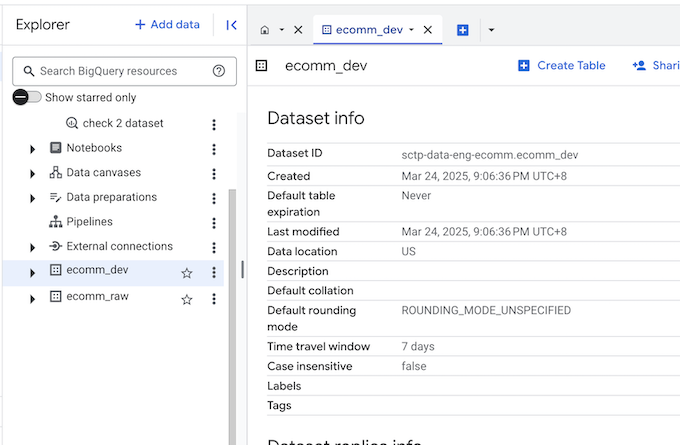
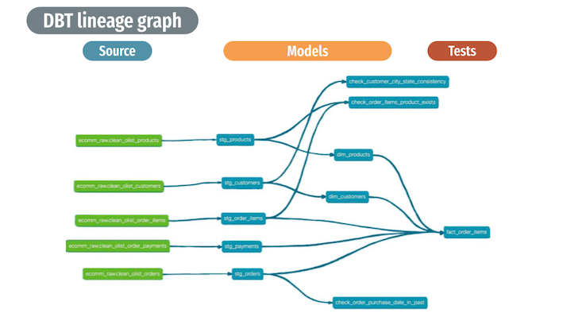
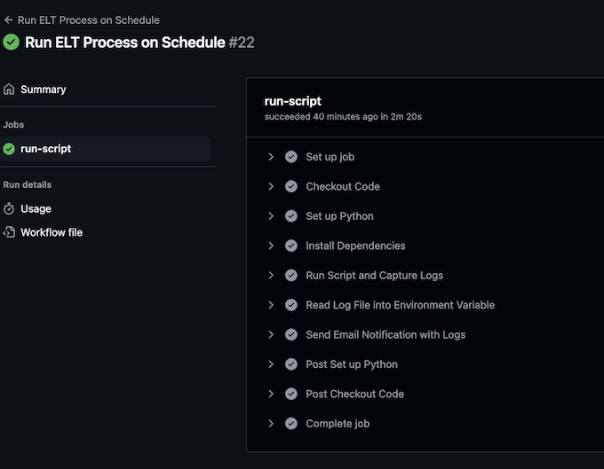
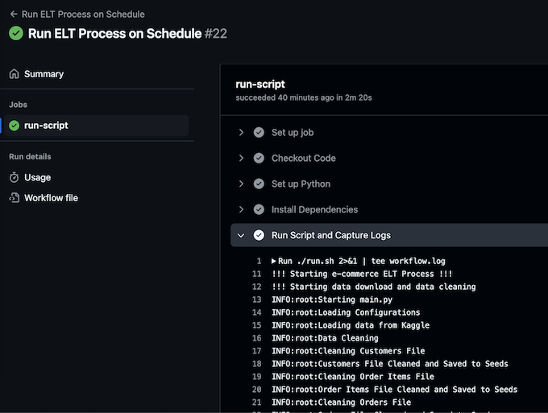

# **Olist ELT Implementation Technical Report**

## **1. Introduction**

- This document provides a technical overview of the Extract, Load, and Transform (ELT) process implemented for processing the **Kaggle Olist Dataset**. 
- The pipeline is designed to automate data ingestion, cleaning, transformation, and storage using **BigQuery** as the primary data warehouse. 
- **dbt** is used as the tool for data ingestion and transformation. 
- Execution is automated through **GitHub Workflow**, with **GitHub Runner** handling the execution process.


## **2. Executive Summary**

### **2.1 Overview of the ELT Process**


- The ELT pipeline extracts data from Kaggle, cleans it, and loads it into **BigQuery** using **dbt seed** for transformation and analysis.
- **GitHub Actions** automates the workflow, ensuring scheduled execution.
- **dbt** is used for data transformation, offering a SQL-based framework for analytics engineers.
- **dbt test** is used to validate the data integrity of the transformed dataset.

### **2.2 Key Findings and Insights**
- **BigQuery** is preferred over **DuckDB** due to scalability and better tooling support.
- **BigQuery** provides user-friendly tools like **Looker Studio** for non-technical users.
- **dbt seed** is simpler and more effective than **Meltano** for managing raw data.
- Using **BigQuery** allows integration with multiple source and target databases.

### **2.3 Challenges and Recommendations**
- **DuckDB file locking** is difficult to manage; **BigQuery** is a better alternative.
- **GitHub Actions' scheduling** is not guaranteed to be on time; an external scheduler should be considered.
- Managing secrets securely remains a challenge; using **GitHub Secrets Manager** is recommended.

## **3. Infrastructure Overview**

Our ELT pipeline is designed to efficiently process and store data using **Google BigQuery** for scalable storage and **GitHub Runner** for execution.

### **3.1 Storage: Google BigQuery**
- Serves as the primary data warehouse.
- Optimized for analytical queries.
- Supports multiple source and target databases.



### **3.2 Execution: GitHub Runner**
- Automates pipeline execution.
- Ensures reproducibility across environments.
- Handles error logging and notifications.


## **4. Data Warehouse Design**




## **5. ELT Process**

The following diagram show the technical flow of the ELT process:


The following shell script (`run.sh`) initiates the ELT process:

```bash
echo '!!! Starting e-commerce ELT Process !!!'

echo '!!! Starting data download and data cleaning'
python main.py

echo '!!! Starting dbt transformation and validation process'
cd dbt_ecomm

echo '!!! Cleaning dbt environment before transformation'
dbt clean

echo '!!! Checking dependencies'
dbt deps

echo '!!! Running dbt seed'
dbt seed --target raw

echo '!!! Running dbt run'
dbt run

echo 'Running dbt test'
dbt test

echo '!!! Cleaning dbt environment after transformation'
dbt clean

echo '!!! ELT Process COMPLETED !!!'
```


### **5.1 Extract (E) - Data Download & Cleaning**
- **Data Source**: The ELT process uses the **Kaggle Olist Dataset**, which contains Brazilian e-commerce transaction data, including orders, customers, products, payments, and seller information. The data source file is in **CSV** format and downloaded via **Kaggle API**.
- **Data Cleaning**: Performed using Python (Pandas, YAML for configuration).

The shell script (`run.sh`) start by running `main.py` for data extraction and cleaning:

```bash
# Run main.py for data extraction and cleaning
python main.py
```

The Python script (`main.py`) performs the following extraction process:

- **Loading configurations** : The `config.yaml` file specifies data paths.
- **Dataset Download**: The script `load_kaggle_dataset()` fetches the dataset from Kaggle
- **Storage**: The raw data is stored locally in folder (`./data`)before further processing.
- **Data Cleaning**: Cleaning multiple datasets (customers, orders, products, payments, etc.)
- Generating cleaned datasets for dbt processing


**Python Code Partial Reference (main.py):**

```python
# Load Data Source from Kaggle
logging.info("Loading data from Kaggle")
load_kaggle_dataset(config["kaggle_source"])
 ...

# Initialize and run data preparation
logging.info("Data Cleaning")

# Cleaning customers file
...
clean_customers_files(source_folder, customers_file_name, seed_destination, cleaned_customers_file_name)

# Cleaning order items file
...
clean_order_items(source_folder, order_items_file_name, seed_destination, cleaned_order_items_file_name)
...

```

### **5.2 Load (L) - Database Preparation**
- **Cleaned data is stored in the dbt seed folder** before loading into BigQuery.
- **dbt seed** transfers the cleaned CSV files into BigQuery.
- We use the file `properties.yml` to define our intended schema for ingestion.

Before transformation, the database environment is set up using dbt:

```bash
cd dbt_ecomm
dbt clean  # Cleaning dbt environment
dbt deps   # Checking dependencies
dbt seed --target raw  # Loading initial data
```

- The `dbt seed` command loads reference data into the database.
- The `dbt deps` command ensures that all dependencies are installed before transformation.

### **5.3 Transform (T) - Data Processing with dbt**
- **dbt run** applies transformation logic.
- **dbt test** validates data integrity.
- **Performance tuning** is done through indexing and partitioning in BigQuery.??

Once the data is ingested, transformation is carried out using dbt:

```bash
dbt run   # Running transformations
```

- The `dbt run` command applies transformation logic to raw data tables.

### **5.4 Data Validation - Data Integrity tes  with dbt**
- **dbt test** validates data integrity.


Once the data is transformed, data integrity test is carried out using dbt:

```bash
dbt test  # Running tests to validate data integrity
dbt clean  # Final cleanup
```

- The `dbt test` command ensures data integrity by checking constraints and relationships.
- The final cleanup removes temporary files and ensures a clean working environment.

## **6. Data Analysis**

Data analysis can be performed using python and pandas code:

Sample code:
```python
from google.cloud import bigquery
from google.oauth2 import service_account
credentials = service_account.Credentials.from_service_account_file(
'../.keys/keys.json')

project_id = 'project-name-in-bigquery'
client = bigquery.Client(credentials= credentials,project=project_id)


# Query: Average Installments per Payment Type
query3 = """
SELECT
  payment_type,
  AVG(payment_installments) AS avg_installments
FROM `sctp-data-eng-ecomm.ecomm_dev.fact_order_items`
WHERE payment_installments IS NOT NULL
GROUP BY payment_type
"""
df3 = client.query(query3).to_dataframe()

```
The following are our analysis:


Non technical user can make use of Looker Studio for some light weight analysis:


## **7. GitHub Workflow for Automation**


### **5.1 Workflow Execution Steps**
- **push**: Runs the process when there is a git push to the main branch. Only for production stage.
- **Manual Trigger**: Developers can manually start the workflow via GitHub UI.
- **Scheduled Execution**: Runs daily at 3:00 PM UTC (11:00 PM Singapore Time) using a `cron` schedule.
- **GitHub Runner** is responsible for executing the scheduled jobs.
- **Steps**:
  - Checkout Code
  - Install Dependencies
  - Run ELT Script
  - Capture Logs
  - Send Email Notification

```yaml
name: Run ELT Process on Schedule

on:
  # push: # use in production stage
  #   branches:
  #     - main  # Adjust if you want to trigger on different branches
  workflow_dispatch:  # Enables manual triggering from GitHub UI
  schedule:
    - cron: '0 15 * * *'  # Runs every day at 3pm UTC 11pm SG time

jobs:
  run-script:
    runs-on: ubuntu-latest
    steps:
      - name: Checkout Code
        uses: actions/checkout@v4
      
      - name: Set up Python
        uses: actions/setup-python@v5
        with:
          python-version: '3.10'
      
      - name: Install Dependencies
        run: |
          python -m pip install --upgrade pip
          if [ -f requirements.txt ]; then pip install -r requirements.txt; fi

      - name: Run Script and Capture Logs
        run: ./run.sh 2>&1 | tee workflow.log
      
      - name: Read Log File into Environment Variable
        run: echo "LOG_CONTENT<<EOF" >> $GITHUB_ENV && cat workflow.log >> $GITHUB_ENV && echo "EOF" >> $GITHUB_ENV
      
      - name: Send Email Notification with Logs
        if: always()
        uses: dawidd6/action-send-mail@v3
        with:
          server_address: smtp.gmail.com
          server_port: 587
          username: ${{ secrets.MAIL_USERNAME }}
          password: ${{ secrets.MAIL_PASSWORD }}
          subject: "GitHub Actions Workflow Run - ${{ job.status }}"
          body: |
            Job Status: ${{ job.status }}
            
            Logs:
            ${{ env.LOG_CONTENT }}
            
            Check full logs here: ${{ github.server_url }}/${{ github.repository }}/actions/runs/${{ github.run_id }}
          to: ${{ secrets.COLLABORATORS_EMAILS }}
          from: "GitHub Actions <no-reply@example.com>"
```

## **8. Performance Analysis**

### **8.1 Execution Time & Success Rate**
- The pipeline executes in **under 5 minutes**.
- GitHub Actions' scheduler **may not be precise**; Google Cloud Scheduler is recommended for critical processes.

### **8.2 Data Quality & Integrity Checks**
- **dbt test** ensures data consistency.
- Data deduplication is handled in the cleaning phase.

## **9. Challenges and Recommendations**

### **9.1 Identified Bottlenecks**
- **Managing service key files** securely.
- **GitHub Actions' scheduling limitations**.

### **9.2 Suggested Improvements**
- Store **service key files** in **GitHub Secrets**.
- Use an **external scheduler** for better job execution reliability.

## **10. Conclusion**
- The ELT pipeline efficiently processes e-commerce transaction data.
- **BigQuery** offers scalability and analytical advantages.
- **GitHub Actions** ensures automation but requires external scheduling for reliability.
- Future enhancements include optimizing resource utilization and testing alternative schedulers.

## **11. Appendix**
### **Github Actions Screenshots**

**Github Actions Runs**


**Github Actions Runs Log**





**Github Actions - Email Notification**


- **SQL queries and scripts used in dbt**.
- **Detailed logs and error handling mechanisms**.
- **References to Kaggle API and dbt documentation**.

