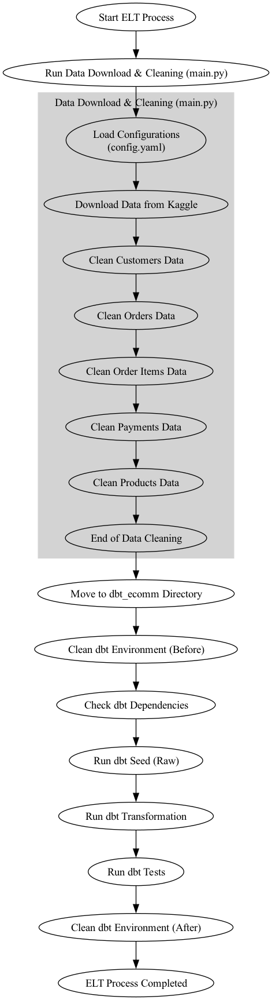

# ELT Pipeline Performance and Analysis Report
Author(s): 
Date
Organization/Project Name

## Executive Summary
### Brief overview of the ELT process
attached charts
### Key findings and insights
- BigQuery is preferred over duckDb contrary to our original design intention
- BiqQuery provide user friendly tools such as Lookout Studio for non technical user
- dbt seed is a simpler and better choice compared to Meltano
- We can have many target database and many source database if we use Bigquery with dbt

### Summary of challenges and recommendations
- Difficult to manage Duckdb file locking mechanism. Use Bigquery instead.##
- Github Action do not guaranteed scheduled job to run on time, need external scheduler to trigger the job if running on time is crucial
- Managing Github Secrets is a challenge   

## Introduction
Purpose of the report

Scope and objectives

Stakeholders and intended audience

## ELT Pipeline Architecture
### Overview of the system architecture

Diagram of data flow (from sources to destination)

### Technologies used (e.g., AWS Glue, Snowflake, dbt, Apache Airflow)
- BigQuery : Compare Duckdb vs Bigquery
    - Duckdb is cheaper but not scalability
    - Bigquery is readily available 24x7
    - Need to consider a separate server to host duckdb
    - Limited tools to access duckdb if not hosted on server
    - Biquery can reference to many source database and have many target database
    - Duckdb can also have many target
    - We manage to source additional database but in doubt if can have more than one external source.

- dbt
    - no coding required except sql scripts
    - quick for deployment instead of coding python
    - accessible by people with SQL knowledge
    - only limited to sql scripts
    - no better alternatives
- Github Actions 
    - readily available and easy to implement
    - Only one configurable yml file is required
    - more steps needed for email notification
    - scheduling is not guarantee on time, not suitable for time critical process
    - however, can use other scheduler such as Google Job Scheduler to trigger the process to imporve the performance (not tested) 

## Data Sources and Extraction Process
Description of data sources (databases, APIs, flat files, etc.)
- Our data source are from Kaggle, it is a zip file that contains multiple files in csv format.
- We need to use Kaggle API to extract all data

Extraction methodology and tools
- We need to use Kaggle API to extract all data
- We use python code with a data extraction function that is loaded with Kaggle API to download the data

Data quality checks and logging mechanisms
- There are no data quality checks during data extractions

## Data Loading Process
Destination databases/data warehouses
- We use python script to load the csv file
- then we perform basic data cleaning 
- cleaned data file in csv format in save into dbt seed folder
- we use dbt seed to transfer the csv file to bigquery

### Batch vs. real-time loading strategies
- for current situation batch processing is good enough
- real-time load is more process intensive and costly, need management to determine if real time is required.

### Data validation and deduplication techniques
- data validation and data deduplication is done during data cleaning using python script and pandas 

## Data Transformation and Processing
### Transformation rules and logic
- transformation rules and logic are defined in the schema under dbt models

### Tools used (SQL, dbt, Python, etc.)
- we use dbt as data transformation tools

### Performance optimization techniques

## Performance Metrics and Monitoring
### Pipeline execution time, success rate, and latency
- Pipleline execution time is less than 5 minutes 
- Github Actions scheduler is not guarantee to process on time
- As improvement consider using Google job scheduler to trigger the job

### Data quality and integrity checks
- data quality and integrity checks are done using dbt test

### Resource utilization (CPU, memory, storage)
- 

## Error Handling and Troubleshooting
### Common errors and resolutions

### Logging and alerting mechanisms (e.g., AWS CloudWatch, Airflow alerts)
- Github Actions with email notifications

### Debugging strategies

10. Security and Compliance
### Data encryption and access control
- Use service key file as it is a private repo

### Compliance with GDPR, HIPAA, or other regulations

### Audit logging and governance policies

## Challenges and Recommendations
### Identified bottlenecks or inefficiencies
- Service key files, although is secured in a private repo it is best to move it to Github Secrets 
- Github scheduler do not run on time. 

Suggested improvements (e.g., performance tuning, automation)
- use Github secrets to keep the keys
- Use external job scheduler to trigger th workflow

Future enhancements

## Conclusion
Summary of key findings

Next steps and action items

## Appendix (if applicable)
SQL queries or scripts used

Detailed logs and data samples

References to documentation or external resources
